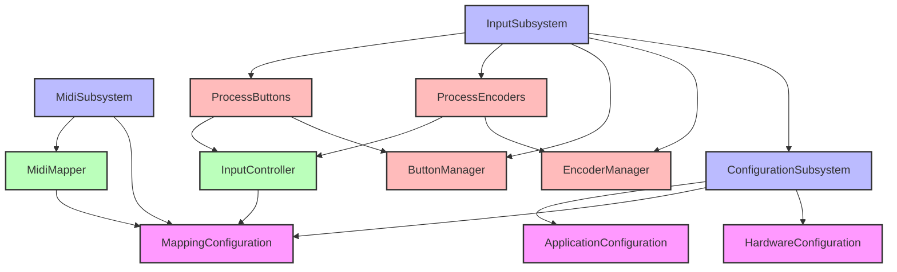

# Analyse des Dépendances - Configuration System

## Vue d'ensemble

Ce document analyse les dépendances actuelles entre les composants de configuration du système MIDI Controller.

## Diagramme de Dépendances



## Points d'Utilisation Détaillés

### 1. HardwareConfiguration

**Utilisé par :**
- `ConfigurationSubsystem` (propriétaire)
  - Expose via `IConfiguration::getAllInputConfigurations()`
  - Expose via `IConfiguration::getInputConfigurationsByType()`
  - Expose via `IConfiguration::getInputConfigurationById()`

**Consommé par :**
- `InputSubsystem`
  - Lit les configurations via `IConfiguration`
  - Extrait `EncoderConfig` et `ButtonConfig`
  - Crée `EncoderManager` et `ButtonManager`

### 2. MappingConfiguration

**Utilisé par :**
- `MidiSubsystem` (accès direct)
  - Passe la référence à `MidiMapper`
  - Utilise pour la configuration initiale

**Consommé par :**
- `MidiMapper`
  - `getMidiMappingForControl()` pour les mappings MIDI
  - `isNavigationControl()` pour identifier les contrôles de navigation
- `InputController`
  - Via `NavigationConfigService` qui encapsule `MappingConfiguration`
  - Détermine si un contrôle est pour la navigation

### 3. Convention ID 1000+

**Documentation de la convention :**
```
- Encodeur ID : 71-80
- Bouton d'encodeur ID : 1071-1080 (ID encodeur + 1000)
- Boutons standalone : 51-52
```

**Endroits où cette convention est utilisée :**
1. `HardwareConfiguration::setInputsConfiguration()`
   - Définit `buttonConfig.id = 1071` pour l'encodeur 71
   - Pattern répété pour tous les encodeurs

2. `MappingConfiguration::setupMapping()`
   - Map `controlId = 1071` pour le bouton de l'encodeur 71
   - Cohérence maintenue manuellement

3. `ControlDefinition::getEncoderButtonId()`
   - Nouvelle méthode qui automatise cette convention
   - `return id + 1000;`

## Flux de Données

### Initialisation

```
1. main.cpp
   └─> InitializationScript::initializeContainer()
       ├─> ConfigurationSubsystem::init()
       │   └─> new HardwareConfiguration()
       │       └─> setInputsConfiguration()
       │
       ├─> InputSubsystem::init()
       │   ├─> resolve<IConfiguration>()
       │   ├─> extractEncoderConfigs()
       │   ├─> extractButtonConfigs()
       │   ├─> new EncoderManager(encoderConfigs)
       │   └─> new ButtonManager(buttonConfigs)
       │
       └─> MidiSubsystem::init()
           └─> new MappingConfiguration()
               └─> setupMapping()
```

### Runtime

```
1. InputSubsystem::update()
   ├─> EncoderManager::updateAll()
   ├─> ButtonManager::updateAll()
   ├─> ProcessEncoders::update()
   │   └─> InputController::handleEncoderChange()
   │       └─> MappingConfiguration::getMidiMappingForControl()
   │
   └─> ProcessButtons::update()
       └─> InputController::handleButtonEvent()
           └─> MappingConfiguration::isNavigationControl()
```

## Points de Couplage Critiques

### 1. ID Synchronization
- **Problème** : Les IDs doivent être synchronisés entre Hardware et Mapping
- **Risque** : Ajout d'un encodeur nécessite des modifications dans 2 fichiers
- **Solution** : UnifiedConfiguration génère automatiquement les deux

### 2. Button Convention
- **Problème** : Convention 1000+ non documentée dans le code
- **Risque** : Facile d'oublier ou de mal implémenter
- **Solution** : `ControlDefinition::getEncoderButtonId()` encode la convention

### 3. Type Safety
- **Problème** : `MappingControlType` duplique `InputType`
- **Risque** : Incohérence possible entre les types
- **Solution** : Unifier ou créer des conversions explicites

### 4. Navigation Controls
- **Problème** : Navigation définie dans Mapping, pas dans Hardware
- **Risque** : Un contrôle hardware peut ne pas avoir de mapping
- **Solution** : ControlDefinition unifie les deux aspects

## Métriques Actuelles

### Taille du Code
- `HardwareConfiguration.cpp` : ~280 lignes
- `MappingConfiguration.cpp` : ~220 lignes
- **Total** : ~500 lignes pour la configuration

### Duplication
- 10 encodeurs × 2 configurations (hardware + mapping) = 20 blocs répétitifs
- 10 boutons d'encodeurs × 2 = 20 blocs supplémentaires
- Pattern de code identique répété 40 fois

### Complexité
- 2 fichiers à maintenir en synchronisation
- 3 conventions implicites (ID 1000+, groupes, ordre)
- 0 validation de cohérence entre Hardware et Mapping

## Recommandations pour la Migration

1. **Préserver la Compatibilité**
   - Les générateurs doivent produire exactement les mêmes structures
   - Tester chaque ID, chaque mapping, chaque configuration

2. **Automatiser les Conventions**
   - ID boutons encodeurs : automatique via `getEncoderButtonId()`
   - Groupes : définis une seule fois dans ControlDefinition
   - Ordre d'affichage : calculé depuis l'ordre de définition

3. **Valider la Cohérence**
   - Impossible d'avoir un mapping sans hardware
   - Impossible d'avoir des IDs dupliqués
   - Validation des pins GPIO

4. **Points de Test Critiques**
   - Vérifier que `EncoderManager` reçoit les bonnes configs
   - Vérifier que `MidiMapper` trouve les bons mappings
   - Vérifier que la navigation fonctionne (ID 51, 52, 79, 1079)

## Prochaine Étape

Créer les tests unitaires pour capturer le comportement actuel avant toute modification.
